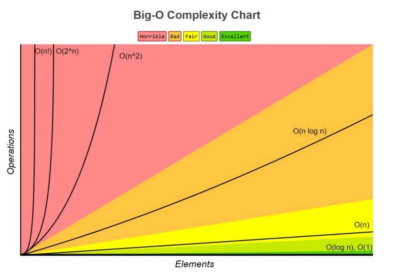

# Big Oh Notation

## Why do we care
- Big Oh defines how much complexity something has
- Complexity can be either time or space
  - Time complexity refers to number of steps taken
    - For example, finding an item in array can take a number of steps depending on algorithm used.
  - Space complexity refers to amount of memory taken. 
    - For example, recursive functions have a lot of space complexity

## Complexity Chart  

## Additional Sources
- [FreeCodeCamp](https://www.freecodecamp.org/news/big-o-notation-why-it-matters-and-why-it-doesnt-1674cfa8a23c/)