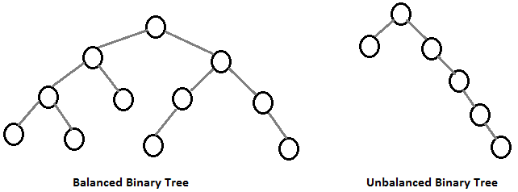
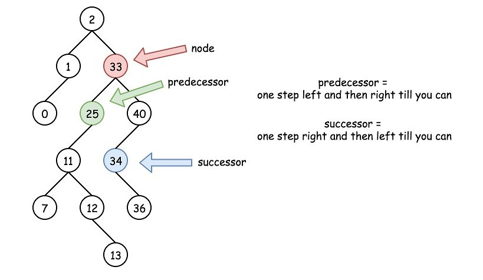

# Speeding Up All The Things With Binary Search Trees

## Recap
- Arrays are great, but they can be unsorted, operations in them to be relatively slow
  - Sorting arrays is useful whenever we are next working with them, yet still takes O(N log N)
  - Insertion and deletion always takes O(N)
- Hash tables are great, but they do not keep order
  - O(1) for insertion, deletion and search
  - Order is not kept
- If we are relying on sorted data, it might be worth creating such structure that that is fast for adding and removing data, as well as searching. Binary tree is an ideal concept

## Trees
- Another node-based data structure
- Classic linked list only contains a single other node
- Trees can have multiple nodes
- Terminology
  - Uppermost (outermost) node is called _root_ (top of the tree)
  - Closest nodes above current node are parents, closest nodes below current node are children
  - All nodes below are descendants, and all nodes above are ancestors
  - Trees have levels - a row in a tree (generation)
  - Trees have a property called _balance_
    - Tree is balanced if nodes' subtrees have same number of nodes in it 

## Binary Search tree
- A binary tree is a tree where each node has zero, one or two children
- Node's _left_ descendants can only contain values that are less than the node itself
- Node's _right_ descendants can only contain values that are higher than the node itself
- A binary tree is more efficient the more balanced it is
  - If we have 5 levels of 5 nodes, we have O(N) for all operations actually
  - When creating from sorted data, it might easily happen that the tree will be extremely imbalanced
- Searching is O(log N)
  - Similarly to binary search, we always eliminate half of the answers
  - Other way to put it is that the amount of levels is the complexity of a tree search
  - We select current node (first iteration root node)
  - Then, if value is bigger, we go to right child
  - Else we go to left child
  - Repeat until value is found
- Insertion is O(log N)
  - Similarly to linked lists, we first need to find a node where to attach new item
  - We first search for suitable node to add it to, then add it either as left child or right child
- Deletion
  - If a node being deleted has no children, simply delete it
  - If a node being deleted has one child, the node will be deleted and the child will take its' place
  - If a node has two children, replace it with a successor node
    - A successor node is a child node whose value is the least of all values that are greater than the node (see img)
    - To find successor node, go to the right child once and then to deepest left child
  - If the successor node has a right child, after perfoming the replacement, take the former right child and turn it into left child of the successor node's parent
  

- Traversal
  - Multiple approaches
  - Inorder traversal is done as part of this chapter to move through the tree. The steps are:
    - Visit left child
    - Visit current node (parent)
    - Visit right child
    - This way, we can move 'in order' - in the way how binary tree is sorted.
  - 

# Exercises start on page 276, solutions available on page 456