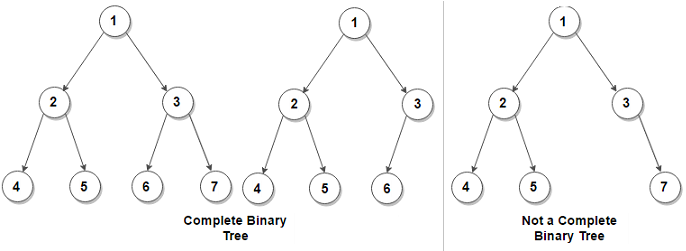

# Keeping Your Priorities Straight with Heaps

## Heap
- A special binary tree
- BST recap:
  - Sorted tree
  - Parent's value must be between left child and right child
  - Left child is always lower
  - Right child is always higher
- Heap
  - Special binary tree
  - Unsorted binary tree
  - min-heap or max-heap. Heaps have _heap condition_
    - min-heap's root value is the lowest of the tree. All descendants' value of any node must be higher.
    - max-heap's root value is the highest of the tree. All descendants' value of any node must be lower.
  - Heaps must be _complete trees_
    - Each level is filled with nodes
    - If there are gaps, they must be limited to the right part of the lowest level
    - 
    - The trees in the above example on the left are complete even though _7_ is missing
    - 7 is in the right part of the lowest level, therefore it is complete
    - If a tree is complete, then it must be well balanced. Because of that, heaps must be complete
    - Balance ensures speed
- Heaps are often used as priority queues - we do not search in heap. We only add at the end or remove from top.
- Heap insertion
  - Adds node to the end of the heap
  - _trickles_ the last node up
    - trickling means comparing with parent and potentially swapping while:
    - parent is greater than newly added node (max-heap)
    - parent is smaller than the newly added node (min-heap)
  - O(log N)
- Heap deletion
  - Places last value at the top of the tree, effectively removing top value
  - _trickles_ the node down
    - compares children. Swaps with:
      - Whichever is higher (max-heap)
      - Whichever is smaller (min-heap)
  - O(log N)
- Due to all values being only higher or only lower when going down the tree, we only need to swap with one in both insertion and deletion
- Both operations are O(log N)
- _Problem of the last node_
  - We use last node for both insertion and deletiong
  - To find such a node, it might be hard (O(N))
  - It is easily solved when using array
    - Rather than actually building a tree, we are just cleverly working with indices
    - To get left child, (index * 2) + 1
    - To get right child, (index * 2) + 2
    - To get parent, Math.floor((index - 1) / 2)
    - Because it's a binary tree and grows as 1 -> 2 -> 4 -> 8, we can work with division and consider value a heap.
    - Last node is always the last item in an array
    - We don't actually delete, we just swap values and remove last element
    - When inserting, we just add at the end of array
    - Both are fast operations

# Exercises start on page 303, solutions available on page 458